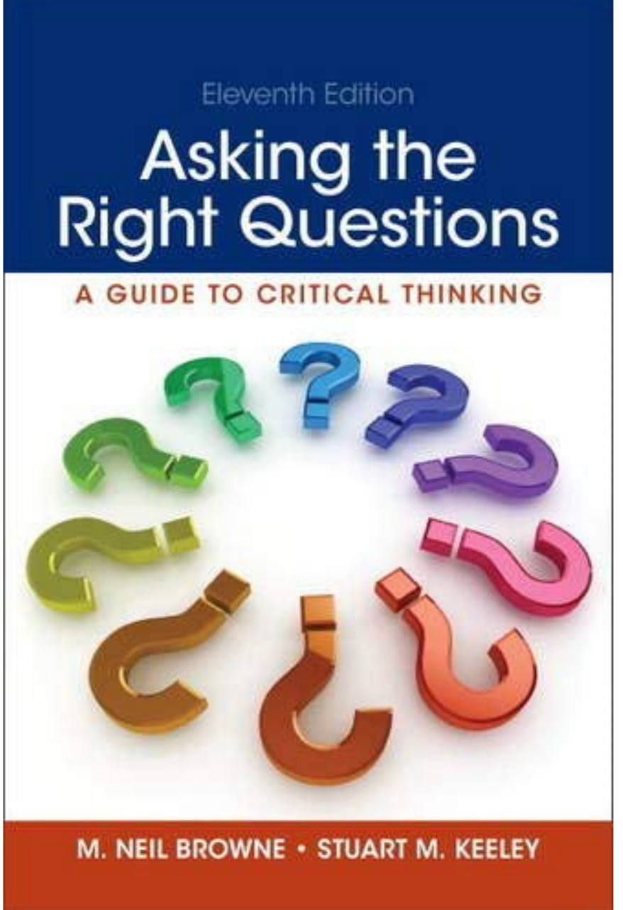

## Summary of 'Asking the Right Questions: A Guide to Critical Thinking'

### Introduction
This repository contains my summary of the book *Asking the Right Questions: A Guide to Critical Thinking* by [M. Neil Browne * Stuart M. Keely]. 

**The Right Questions:**

1. What are the issues and the conclusions?
2. What are the reasons?
3. Which words or phrases are ambiguous?
4. What are the value conflicts and assumptions?
5. What are the descriptive assumptions?
6. Are there any fallacies in the reasoning?
7. How good is the evidence?
8. Are there rival causes?
9. Are the statistics deceptive?
10. What significant information is omitted?
11. What reasonable conclusions are possible?

### About the Book
'Asking the Right Questions' guides readers through a series of questions that are essential for critical analysis. The book helps students bridge the gap between simply memorizing or blindly accepting information and the greater challenge of critical analysis and synthesis. It teaches them to respond to alternative points of view and develop a solid foundation for making personal choices about what to accept and what to reject.
It covers topics such as Issue, Conclusion, Reason, Value Conflicts and Assumptions, Fallacies, and Evidence.

### How to Use This Summary
I recommend using this summary as a companion to reading the full book, a quick reference, and a reminder tool of the book’s key concepts and strategies. 

